# Sub-Zero

> **Offline. Hardware-adaptive. Quality-gated. Built for real long-form subtitle work — not toy demos.**

Sub-Zero is an offline subtitle engine designed for people who care about **speed, correctness, recovery, and quality under pressure**.

It takes video/audio/subtitle input, runs a hardware-aware execution plan, translates subtitles through a multi-stage rescue pipeline, and refuses to silently ship weak output.

This project was not built because I wanted “just another subtitle tool.”

It was built because I got annoyed enough to make something better.

---

## Why This Project Exists

This started from a very real and very specific problem.

I was watching a stream from the actress behind the main character of **Silent Hill f**. I understand some Japanese, but not enough to comfortably follow everything at native speed, so I was relying on **YouTube auto subtitles**.

That worked... until it didn’t.

There were times I wanted to download the stream and watch it later — like on a plane, offline, no connection, no YouTube subtitle layer, no safety net. And that was the problem:

- the subtitles only existed inside YouTube
- I couldn’t find proper subtitle files for the stream
- the fallback options were weak, fragile, or painfully low quality

So instead of accepting that, I built the thing I wanted to exist.

**Sub-Zero was born.**

Reference stream that triggered the project:

- [SILENT HILL f #1 加藤小夏](https://www.youtube.com/watch?v=0Ek5c3sQygs&t=537s)

This is not a “look, I made an app” project.

This is a **real frustration turned into a serious system**.

  

---

## What Sub-Zero Actually Is

Sub-Zero is an **offline-first subtitle engine** focused on **real-world long-form content quality**, not just raw throughput.

Most subtitle tools optimize one axis and collapse somewhere else:

- fast but unstable
- good quality but painfully fragile
- decent output until the first OOM / backend failure / weird segment
- zero protection when translation quality drops off a cliff

Sub-Zero is built to solve that.

Its core design is:

- **offline-first runtime**
- **hardware-adaptive execution**
- **quality-gated outputs**
- **recovery-first behavior**
- **fail-loud philosophy**
- **cross-run learning through history + knowledge cache**

The goal is simple:

> finish fast when possible, recover when needed, and never pretend bad output is acceptable.

---

## Core Features

- Offline subtitle generation and translation
- Input support for video, audio, and existing subtitle files
- Hardware-adaptive runtime planning
- OOM-aware retry and execution recovery
- Scene-level rescue for weak translation ranges
- Structural and semantic subtitle validation
- Discourse consistency rewrites
- Checkpointed execution behavior
- Knowledge/history cache for better future planning
- Strict quality gates before final output

---

## High-Level Pipeline

```mermaid
flowchart LR
  A[Input: video/audio/srt] --> B[Source Resolver]
  B --> C[Deep Scan]
  C --> D[Hardware Probe]
  D --> E[DOOM-QLOCK Plan]
  E --> F[Execution]

  F --> G[Transcription Path]
  F --> H[Translation Path]

  G --> I[Confidence + Quality Checks]
  H --> I
  I --> J[Scene Rescue + Replan]
  J --> K[Discourse Consistency + Postprocess]
  K --> L[Final Structural/Semantic Gate]

  L -->|PASS| M[Emit .srt + metadata]
  L -->|FAIL| N[Fail Loud with diagnostics]

  M --> O[History + Knowledge Cache]
```

---

## Architecture / Code Map

### Runtime entry and orchestration

- `src/main.rs`
  - CLI entrypoint
  - builds config
  - launches the pipeline

- `src/engine/pipeline.rs`
  - main orchestration layer
  - source resolution
  - translation flow
  - quality gate enforcement
  - metadata writing

### Planning and workload understanding

- `src/engine/doom_qlock.rs`
  - adaptive execution policy engine
  - hardware probing
  - workload estimation
  - plan compilation
  - history/knowledge learning

- `src/engine/deep_scan.rs`
  - generates a content map from media or SRT
  - scene boundaries
  - silence/speech ratios
  - difficulty hints

### Execution and translation layers

- `src/engine/transcribe.rs`
  - transcription integration
  - strict-mode settings

- `src/engine/parallel.rs`
  - chunk worker execution
  - timeout handling
  - retry behavior

- `src/engine/stitcher.rs`
  - partial chunk merge
  - dedupe logic

- `src/engine/context.rs`
  - translation context-window construction

- `src/engine/neural_mt.rs`
  - Rust/Python bridge for batch translation

- `src/engine/translate.rs`
  - translation backend selection
  - emergency fallback ladder
  - quality scoring

### Output cleanup and subtitle primitives

- `src/engine/postprocess.rs`
  - cleanup
  - normalization
  - rewrite passes

- `src/engine/srt.rs`
  - SRT parsing and writing primitives

### Scripts / tooling

- `scripts/translate_batch.py`
  - batch translator worker
  - OOM fallback handling
  - adaptive tag policy

- `scripts/evaluate_sub_quality.py`
  - benchmark evaluator against reference subtitles
  - timeline-overlap-aware comparison

- `scripts/release/bootstrap_models.sh`
  - local model cache bootstrap

- `scripts/release/package_release.sh`
  - release packaging

---

## DOOM-QLOCK

### The name is dramatic on purpose.

Because this layer exists for the exact moment subtitle pipelines usually die: OOM, unstable backend behavior, bad chunk sizing, slow execution plans, or silent quality collapse.

**DOOM-QLOCK** is Sub-Zero’s adaptive execution policy engine.

It decides how the system should run **for this machine, for this workload, right now**.

### What it does at startup

At run start, DOOM-QLOCK:

- probes the machine
  - CPU
  - RAM
  - GPU backend
  - VRAM
  - disk write performance
- scans the workload
  - duration
  - cue count estimate
  - content difficulty hints
- checks prior successful execution history
- looks for similar known-good plans
- compiles a safe execution strategy:
  - worker counts
  - chunk sizing
  - MT batch size
  - token budgets
  - retry policy

### What it does during execution

During the run, it monitors:

- runtime behavior
- translation quality signals
- backend instability
- OOM patterns
- rescue necessity

If the run starts misbehaving, it can replan by:

- shrinking batch size
- shrinking token budget
- stepping down aggressiveness
- switching to safer decode behavior
- retrying through safer execution paths

### What it does after execution

After the run, it stores:

- run telemetry
- successful plans
- normalized knowledge snapshots
- device/language/content statistics

That means the system does not just run.

It **learns how to run better next time**.

---

## The Algorithmic Philosophy

Sub-Zero is not “send chunks into a model and pray.”

The algorithm is built around the idea that subtitle quality is not one event — it is a **pipeline of constraints, recovery logic, and quality enforcement**.

### The system thinks in stages

1. **Understand the source**
   - detect what the input actually is
   - inspect structure
   - estimate workload and complexity

2. **Understand the machine**
   - detect hardware capacity
   - estimate safe execution limits
   - select backend-aware execution policy

3. **Generate a plan**
   - choose chunking strategy
   - choose parallelism level
   - choose translation batch/tokens
   - define fallback ladder before failure happens

4. **Execute with monitoring**
   - process chunks
   - score intermediate output
   - watch for quality drop-offs and runtime anomalies

5. **Rescue weak regions**
   - identify weak scenes/ranges
   - selectively re-run or re-translate them
   - avoid paying full rerun cost for local failures

6. **Repair global consistency**
   - normalize repeated terms
   - stabilize names and phrasing
   - reduce discourse drift across long-form content

7. **Gate the result**
   - structural validation
   - semantic validation
   - final pass/fail decision

### Why this matters

A lot of systems can produce output.

Much fewer systems can answer:

- Is the output structurally valid?
- Is it semantically stable?
- Is this weak scene acceptable?
- Should this run be retried?
- Should this pass be rejected even if it “finished”?
- Is compaction improving the file or damaging meaning?

Sub-Zero is built to answer those questions explicitly.

---

## What Makes the Algorithm Different

This is the part that deserves more respect than a typical “we translate subtitles” README paragraph.

The interesting part is **not** that Sub-Zero runs transcription and translation.
The interesting part is that it treats subtitle generation as a **controlled systems problem**.

The algorithm combines four ideas:

### 1. Pre-execution planning instead of blind execution

Before heavy work begins, the runtime does not just launch aggressive defaults and hope the machine survives.
It measures the machine, scans the workload, estimates risk, and compiles a plan that is meant to succeed *on that exact setup*.

That means the system is doing predictive runtime shaping, not static tool execution.

### 2. Local rescue instead of global reruns

When quality drops in isolated regions, Sub-Zero does not assume the whole run is bad.
It identifies weak scenes, rescues those ranges, and preserves strong regions.

This keeps the system efficient while still enforcing standards.

### 3. Final quality is decided by gates, not vibes

A finished output is still just a candidate.
It must survive:

- structural checks
- semantic checks
- consistency passes
- final thresholding

The pipeline is designed to reject “technically completed” garbage.

### 4. Learning across runs

Sub-Zero stores normalized run history and knowledge snapshots so future execution planning gets smarter.

So the algorithm is not only adaptive during a run.
It is also **adaptive across runs**.

That matters a lot for repeated workloads, similar hardware, and recurring subtitle generation patterns.

---

## Quality System

Sub-Zero does **not** assume that successful inference means good subtitles.

That assumption is how bad output gets shipped.

Instead, it enforces a layered quality system:

- structural checks
- semantic checks
- scene-level rescue for weak segments
- discourse consistency passes
- final gate before writing results

### Strict behavior

Strict mode is intentionally strict.

- high quality floor
- weak outputs are not silently accepted
- borderline outputs near threshold may be accepted with warning
  - this avoids wasting huge rerun cost for near-identical quality margins
- clearly bad outputs fail loudly with diagnostics

This is one of the project’s main identities:

> **completion is not success — quality is success**

---

## Recovery-First Design

Real systems fail in messy ways.

Sub-Zero is designed around that reality.

Recovery behavior includes:

- OOM retry ladder
- safer decode retries
- backend-aware adaptation
- timeout-aware chunk execution
- checkpoint-friendly pipeline behavior
- conservative fallback paths where policy allows

Instead of treating failures like edge cases, Sub-Zero treats them as part of the runtime contract.

---

## Hardware Adaptation

Sub-Zero adapts across different hardware profiles instead of assuming one “ideal” machine.

Current adaptation includes:

- CUDA-aware tuning
- ROCm-aware tuning
- Metal-aware tuning
- VRAM-aware batch/token shrinking
- OOM recovery policy
- optional CPU fallback
- timeout + retry tuning in chunk execution

This allows the same system to operate across:

- NVIDIA / CUDA systems
- AMD / ROCm systems
- macOS / Metal systems
- CPU-only fallback environments

---

  

## Real Run Status

### Verified long-form strict run

**Input**
- `SILENT HILL f #1 加藤小夏 [0Ek5c3sQygs].ja.srt`

**Detected hardware**
- RTX 4070 Laptop GPU (~8GB visible VRAM)
- 32 CPU threads

**Run outcome**
- strict run completed successfully

**Runtime**
- `302.4s` for a `6259.9s` subtitle timeline workload

### Notable runtime events

- OOM retry occurred and recovered successfully
- scene rescue executed
- discourse consistency rewrites executed
- cue compaction safety rejected a regressive pass and kept the better-quality path

That is exactly the kind of behavior this project was built for:

not just “it ran,” but **it hit real problems and recovered correctly**.

---

## Benchmarking Against External Reference

Reference subtitle file:

- `SUB-NOT-FROM-my-PROGRAME/SILENT HILL f #1 加藤小夏NOTFROMTHEPROGRAME.srt`

Report artifact:

- `benchmarks/reports/2026-03-07_silent_hill_ab.json`

### Current gap summary

- best candidate still differs from the reference primarily in segmentation and timing style
- content overlap is already meaningful
- alignment to reference subtitle conventions is not yet strong enough
- benchmark evaluation now uses timeline-overlap alignment instead of brittle index-to-index matching

This matters because real subtitle evaluation is not just “same line number, same text.”

It has to survive timing drift and segmentation differences.

---

## Release / Distribution State

Release workflow already exists for:

- bootstrapping local model cache layout
- packaging release binary + minimal runtime files

Example generated artifact:

- `dist/sub-zero_linux-x86_64_20260307_010013.tar.gz`

---

## What’s Strong Right Now

- end-to-end offline pipeline
- hardware-aware planning
- recovery-first execution
- fail-loud quality behavior
- real long-form workload validation
- strong test suite coverage
- benchmark-aware evaluation path
- not a toy demo

---

## What’s Next

High-impact next steps:

- reference-style segmentation mode
- time-warp post-pass for cue boundary tuning
- better short-utterance lexical normalization
- wider benchmark suite across more videos and language pairs

---

## Design Principles

Sub-Zero follows a few non-negotiable rules:

1. **Offline first**
   - the tool should remain useful without platform dependency

2. **Adapt to the machine**
   - don’t force one static plan onto every system

3. **Recover before giving up**
   - failures should trigger smarter fallback behavior, not immediate collapse

4. **Fail loudly when quality is bad**
   - a finished run is useless if the subtitles are garbage

5. **Real workloads matter**
   - long-form content is the target, not tiny demo clips

---

## Product Positioning

> **Sub-Zero is an offline, hardware-adaptive subtitle engine that optimizes for speed and correctness together, with strict quality gates, automatic recovery, and reproducible long-form performance.**

---

## Closing Note

This project exists because I was annoyed by a very specific real-world problem and refused to accept the usual weak solutions.

I wanted to watch a stream offline.
I wanted subtitles that didn’t disappear with the platform.
I wanted something fast, strict, resilient, and serious.

So I built it.

And because the name was too good not to use:

**Sub-Zero.**
