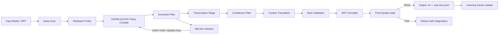

# Sub-Zero

Sub-Zero is an offline subtitle engine by **IBVOID**.
It transcribes, translates, validates, and emits production-ready subtitles with adaptive runtime planning.

## What It Does
- Offline subtitle generation from video/audio.
- Offline subtitle-to-subtitle translation (`.srt -> .srt`).
- Adaptive hardware planning via **IBVoid DOOM-QLOCK**.
- Strict quality gates with fail-loud behavior.
- Checkpoint/resume and recovery ladder for long runs.

## System Architecture


## Algorithm Flow (IBVoid DOOM-QLOCK)
1. Probe content and hardware.
2. Select the fastest valid plan for current constraints.
3. Execute with chunk-level monitoring and adaptive replanning.
4. Enforce structural and semantic subtitle quality gates.
5. Persist run telemetry to improve next runs on similar hardware/content.

## Quick Start
```bash
cargo build --release --offline

# Example: Japanese -> English, strict profile, GPU requested
cargo run --release -- \
  -i "input.mkv" \
  --source-lang ja \
  --lang en \
  --offline \
  --profile strict \
  --gpu
```

## Core CLI
```bash
sub-zero -i <input> --source-lang <src> --lang <dst> [options]
```

Key options:
- `--profile fast|balanced|strict`
- `--transcribe` / `--no-transcribe`
- `--gpu` / `--require-gpu`
- `--parallel --workers <N> --chunk-duration <sec>`
- `--doom-qlock` / `--no-doom-qlock`

## Outputs
- `<input_stem>.<target_lang>.srt`
- `<input_stem>.sub-zero.json` (run metadata, quality signals, recovery events)

## Validation
```bash
cargo fmt --all -- --check
cargo clippy --all-targets -- -D warnings
cargo test --all
```

## Release Workflow
```bash
# Prepare model cache layout
scripts/release/bootstrap_models.sh

# Build + package release artifact
scripts/release/package_release.sh
# or: scripts/release/package_release.sh x86_64-unknown-linux-gnu
```
