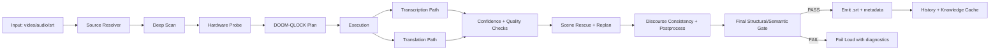

# Sub-Zero

> **Offline. Hardware-adaptive. Quality-gated. Built for real long-form subtitle work — not toy demos.**

Sub-Zero is an offline subtitle engine designed for **speed, correctness, recovery, and quality under pressure**.

It takes video/audio/subtitle input, runs a hardware-aware execution plan, translates subtitles through a multi-stage rescue pipeline, and refuses to silently ship weak output.

---

## Why This Project Exists

I was watching a stream from the actress behind the main character of **Silent Hill f**. I understand some Japanese, but not enough to follow everything at native speed, so I was relying on **YouTube auto subtitles**.

That worked... until it didn't.

There were times I wanted to download the stream and watch it later — like on a plane, offline, no connection, no YouTube subtitle layer. And that was the problem:

- the subtitles only existed inside YouTube
- I couldn't find proper subtitle files for the stream
- the fallback options were weak, fragile, or painfully low quality

So instead of accepting that, I built the thing I wanted to exist.

**Sub-Zero was born.**

Reference stream: [SILENT HILL f #1 加藤小夏](https://www.youtube.com/watch?v=0Ek5c3sQygs&t=537s)

---

## Core Features

- Offline subtitle generation and translation
- Input support for video, audio, and existing subtitle files
- Hardware-adaptive runtime planning
- OOM-aware retry and execution recovery
- Scene-level rescue for weak translation ranges
- Structural and semantic subtitle validation
- Discourse consistency rewrites
- Checkpointed execution behavior
- Knowledge/history cache for better future planning
- Strict quality gates before final output

---

## High-Level Pipeline

```mermaid
flowchart LR
  A[Input: video/audio/srt] --> B[Source Resolver]
  B --> C[Deep Scan]
  C --> D[Hardware Probe]
  D --> E[DOOM-QLOCK Plan]
  E --> F[Execution]

  F --> G[Transcription Path]
  F --> H[Translation Path]

  G --> I[Confidence + Quality Checks]
  H --> I
  I --> J[Scene Rescue + Replan]
  J --> K[Discourse Consistency + Postprocess]
  K --> L[Final Structural/Semantic Gate]

  L -->|PASS| M[Emit .srt + metadata]
  L -->|FAIL| N[Fail Loud with diagnostics]

  M --> O[History + Knowledge Cache]
```

---

## Architecture / Code Map

### Runtime entry and orchestration

- `src/main.rs` — CLI entrypoint, config, pipeline launch
- `src/engine/pipeline.rs` — orchestration, source resolution, translation flow, quality gates, metadata

### Planning and workload understanding

- `src/engine/doom_qlock.rs` — adaptive execution policy engine, hardware probing, plan compilation, learning
- `src/engine/deep_scan.rs` — content map generation, scene boundaries, difficulty hints

### Execution and translation layers

- `src/engine/transcribe.rs` — transcription integration, strict-mode settings
- `src/engine/parallel.rs` — chunk worker execution, timeout handling, retry
- `src/engine/stitcher.rs` — partial chunk merge, dedupe logic
- `src/engine/context.rs` — translation context-window construction
- `src/engine/neural_mt.rs` — Rust/Python bridge for batch translation
- `src/engine/translate.rs` — translation backend selection, fallback ladder, quality scoring

### Output cleanup and subtitle primitives

- `src/engine/postprocess.rs` — cleanup, normalization, rewrite passes
- `src/engine/srt.rs` — SRT parsing and writing primitives

### Scripts / tooling

- `scripts/translate_batch.py` — batch translator worker, OOM fallback, adaptive tag policy
- `scripts/evaluate_sub_quality.py` — benchmark evaluator, timeline-overlap-aware comparison
- `scripts/release/bootstrap_models.sh` — local model cache bootstrap
- `scripts/release/package_release.sh` — release packaging

---

## DOOM-QLOCK

### The name is dramatic on purpose.

Because this layer exists for the exact moment subtitle pipelines usually die: OOM, unstable backend behavior, bad chunk sizing, slow execution plans, or silent quality collapse.

**DOOM-QLOCK** is Sub-Zero's adaptive execution policy engine.

It decides how the system should run **for this machine, for this workload, right now**.

**At startup** it probes the machine (CPU, RAM, GPU, VRAM, disk), scans the workload (duration, cue count, difficulty), checks prior execution history, and compiles a safe execution strategy (worker counts, chunk sizing, MT batch/token budgets, retry policy).

**During execution** it monitors runtime behavior, translation quality, backend instability, and OOM patterns. If things go wrong, it replans — shrinking batch sizes, stepping down aggressiveness, or switching to safer execution paths.

**After execution** it stores run telemetry, successful plans, and normalized knowledge snapshots. The system doesn't just run — it **learns how to run better next time**.

---

## How the Algorithm Works

Sub-Zero treats subtitle generation as a **controlled systems problem**, not "send chunks into a model and pray."

The algorithm is built around four ideas:

### 1. Pre-execution planning instead of blind execution

Before heavy work begins, the runtime measures the machine, scans the workload, estimates risk, and compiles a plan meant to succeed *on that exact setup*. Predictive runtime shaping, not static tool execution.

### 2. Local rescue instead of global reruns

When quality drops in isolated regions, Sub-Zero identifies weak scenes, rescues those ranges, and preserves strong regions. Efficient while still enforcing standards.

### 3. Final quality decided by gates, not vibes

A finished output is still just a candidate. It must survive structural checks, semantic checks, consistency passes, and final thresholding. The pipeline rejects "technically completed" garbage.

### 4. Learning across runs

Run history and knowledge snapshots mean future execution planning gets smarter — adaptive during a run and **adaptive across runs**.

---

## Quality System

Sub-Zero does **not** assume that successful inference means good subtitles.

It enforces a layered quality system:

- structural checks
- semantic checks
- scene-level rescue for weak segments
- discourse consistency passes
- final gate before writing results

Strict mode enforces a high quality floor where weak outputs are not silently accepted, borderline outputs near threshold may pass with a warning (avoiding huge rerun cost for marginal gains), and clearly bad outputs fail loudly with diagnostics.

> **Completion is not success — quality is success.**

---

## Recovery-First Design

Recovery behavior includes:

- OOM retry ladder
- safer decode retries
- backend-aware adaptation
- timeout-aware chunk execution
- checkpoint-friendly pipeline behavior
- conservative fallback paths where policy allows

Failures are part of the runtime contract, not edge cases.

---

## Hardware Adaptation

Sub-Zero adapts across different hardware profiles:

- CUDA-aware tuning (NVIDIA)
- ROCm-aware tuning (AMD)
- Metal-aware tuning (macOS)
- VRAM-aware batch/token shrinking
- OOM recovery policy
- optional CPU fallback

---

  

## Real Run Status

### Verified long-form strict run

**Input**: `SILENT HILL f #1 加藤小夏 [0Ek5c3sQygs].ja.srt`
**Hardware**: RTX 4070 Laptop GPU (~8GB visible VRAM), 32 CPU threads
**Runtime**: `302.4s` for a `6259.9s` subtitle timeline workload

Notable events: OOM retry recovered successfully, scene rescue executed, discourse consistency rewrites executed, cue compaction safety rejected a regressive pass and kept the better-quality path.

Not just "it ran," but **it hit real problems and recovered correctly**.

---

## Benchmarking

Reference: `SUB-NOT-FROM-my-PROGRAME/SILENT HILL f #1 加藤小夏NOTFROMTHEPROGRAME.srt`
Report: `benchmarks/reports/2026-03-07_silent_hill_ab.json`

Best candidate still differs from reference primarily in segmentation and timing style. Content overlap is already meaningful. Benchmark evaluation uses timeline-overlap alignment instead of brittle index-to-index matching.

---

## What's Next

- Reference-style segmentation mode
- Time-warp post-pass for cue boundary tuning
- Better short-utterance lexical normalization
- Wider benchmark suite across more videos and language pairs

---

## Closing Note

This project exists because I was annoyed by a very specific real-world problem and refused to accept the usual weak solutions.

I wanted to watch a stream offline.
I wanted subtitles that didn't disappear with the platform.
I wanted something fast, strict, resilient, and serious.

So I built it.

And because the name was too good not to use:

**Sub-Zero.**
